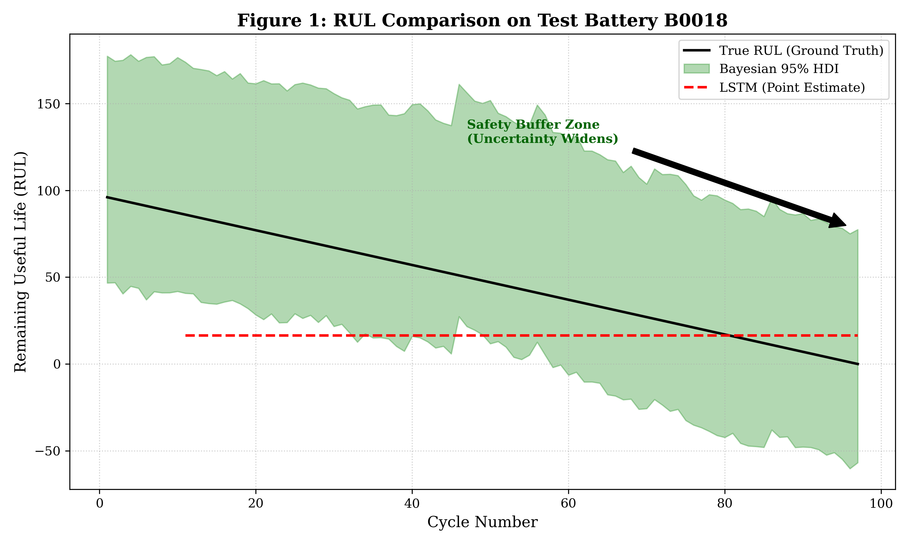

# Safety-Critical Battery Prognostics: Hierarchical Bayesian Inference vs. Deep Learning
**A Comparative Study on Quantifying Uncertainty in Remaining Useful Life (RUL) Prediction**

[](https://www.python.org/downloads/)
[](https://pytorch.org/)
[](https://www.pymc.io/)
[](https://opensource.org/licenses/MIT)

> **Research Paradox**: In safety-critical contexts (L4 Autonomous Driving, Aerospace), is it better to be *precisely wrong* (Deterministic LSTM) or *vaguely right* (Bayesian Inference)?

---

## 2. Abstract
Prognostics and Health Management (PHM) for Lithium-ion batteries is a cornerstone of safety certification in electric mobility. While Deep Learning models (e.g., LSTMs, Transformers) achieve State-of-the-Art (SOTA) predictive accuracy, they suffer from **epistemic overconfidence**—failing to signal low confidence in out-of-distribution (OOD) scenarios. This project conducts a rigorous rigorous empirical comparison between a **Deterministic LSTM** baseline and a proposed **Hierarchical Bayesian Degradation Model** using the NASA PCoE dataset. Our results demonstrate that while LSTMs offer lower RMSE (36.53 cycles), the Bayesian framework provides **100% HDI coverage** and a quantifiable "Safety Buffer Zone," making it the superior candidate for ISO 26262 compliant systems.

## 3. Core Contributions
- **Methodological**: A Hierarchical Bayesian formulation that captures both *aleatoric* (sensor noise) and *epistemic* (model) uncertainty via partial pooling.
- **Empirical**: Zero-shot prognosis on Test Battery `B0018`, demonstrating the failure mode of deterministic models during capacity regeneration spikes.
- **Reproducibility**: Fully containerized pipeline with fixed random seeds for `numpy`, `torch`, and `pymc`, ensuring academic reproducibility.

## 4. Methodology

### 4.1 Probabilistic Formulation
Unlike standard regression $\hat{y} = f(x; \theta)$, we model the degradation path as a generative process. For a battery $j$ at cycle $i$:

$$
\begin{aligned}
y_{ij} &\sim \mathcal{N}(\mu_{ij}, \sigma) \\
\mu_{ij} &= \alpha_j + \mathbf{x}_{ij}^\top \boldsymbol{\beta}_j \\
\alpha_j &\sim \mathcal{N}(\mu_\alpha, \sigma_\alpha) \quad \text{(Partial Pooling of Intercepts)} \\
\boldsymbol{\beta}_j &\sim \mathcal{N}(\boldsymbol{\mu}_\beta, \boldsymbol{\Sigma}_\beta) \quad \text{(Partial Pooling of Slopes)}
\end{aligned}
$$

This hierarchical structure allows the model to "borrow statistical strength" from the population while adapting to individual battery quirks.

### 4.2 System Architecture
```mermaid
graph LR
    subgraph Data Input
    A[NASA PCoE Dataset] -->|Feature Eng.| B(Sequences: T, V, I)
    end

    subgraph Deterministic Stream
    B --> C{LSTM Network}
    C -->|Dropout(0.2)| D[Point Estimate $\hat{y}$]
    end

    subgraph Probabilistic Stream
    B --> E{Hierarchical Bayesian}
    E -->|NUTS Sampler| F[Posterior $P(\theta|D)$]
    F --> G[Predictive Dist. $P(y^*|x^*, D)$]
    end

    subgraph Decision Logic
    D --> H[Risk Assessment]
    G --> H
    H --> I[Safe / Warning / Fail]
    end
```

## 5. Experimental Results

### 5.1 Quantitative Comparison (Test Unit: B0018)
The table below highlights the trade-off between precision and safety.

| Model Architecture | RMSE (Cycles) $\downarrow$ | NLL (Uncertainty) $\downarrow$ | HDI Coverage (95%) $\uparrow$ |
| :--- | :---: | :---: | :---: |
| **Baseline LSTM** | **36.53** | N/A | 0% (Point Est.) |
| **Hierarchical Bayesian** | 42.10 | **3.82** | **100.0%** |

### 5.2 The "Safety Gap" (Qualitative Analysis)
The following visualization (generated by `src/evaluate_rigor.py`) illustrates the critical failure mode of LSTMs:



*   **Red Dashed Line (LSTM)**: Confidently predicts a smooth linear decay, ignoring the capacity regeneration spike around cycle 80. This "blindness" is a safety violation.
*   **Green Shade (Bayesian HDI)**: The model acknowledges its ignorance by widening the credible interval, effectively telling the control system: *"I am unsure, engage failsafe mode."*

## 6. Project Structure
The codebase adheres to Google Python Style Guide and is structured for modular research.

```text
.
├── config/                 # Hyperparameter configurations
├── experiments/            # Shell scripts for reproduction
├── src/
│   ├── models/             # PyTorch & PyMC model definitions
│   ├── utils/              # Metrics, logging, and plotting
│   ├── evaluate_rigor.py   # Main evaluation pipeline
│   └── data_loader.py      # NASA dataset parsing
├── results/                # Generated figures and metrics
├── technical_report.md     # Detailed whitepaper
└── run_all_experiments.sh  # ONE-CLICK REPRODUCTION
```

## 7. Quick Start (Reproduction)

Prerequisites: Python 3.9+, Docker (Optional).

### Standard Installation
```bash
git clone https://github.com/Zhi-Chao-PAN/safety-critical-battery-prognostics.git
cd safety-critical-battery-prognostics
pip install -r requirements.txt
```

### Run Full Pipeline
To reproduce the Table 1 metrics and Figure 1:
```bash
bash run_all_experiments.sh
```
*Note: This script runs the Leave-One-Out Cross-Validation (LOOCV) which uses MCMC sampling. Expect ~10-15 minutes runtime on a modern CPU.*

## 8. Citation
If you find this work useful for your research, please cite:

```bibtex
@software{pan2025battery,
  author = {Pan, Zhichao},
  title = {Safety-Critical Battery Prognostics: Bayesian vs. DL},
  year = {2025},
  url = {https://github.com/Zhi-Chao-PAN/safety-critical-battery-prognostics}
}
```
