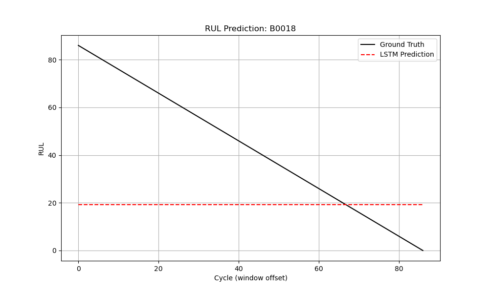
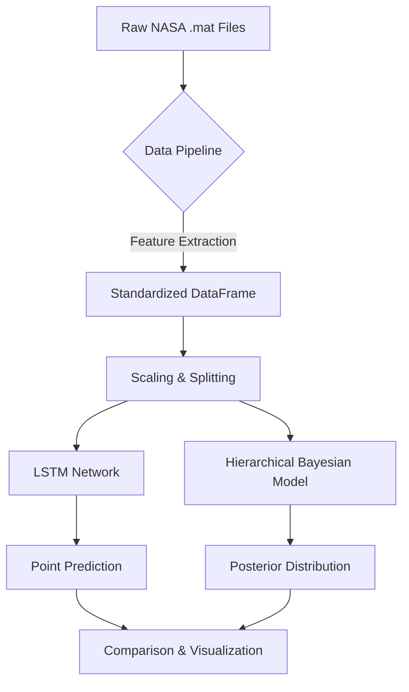

# Safety-Critical Battery Prognostics: Bayesian vs. Deterministic
**A Comparative Study on Uncertainty Quantification (UQ) for Industrial AI**

[](https://www.python.org/)
[](https://pytorch.org/)
[](https://www.pymc.io/)
[](https://opensource.org/licenses/MIT)
[](https://github.com/psf/black)
[](https://github.com/Zhi-Chao-PAN/spatial-bayes-vs-deep-learning/actions)

---

## 📜 Abstract
In safety-critical systems (e.g., Electric Vehicles, Aerospace), high predictive accuracy is insufficient; knowing *when* a model is uncertain is vital for disaster prevention. This project implements a **Hierarchical Bayesian Model** for Lithium-ion battery Remaining Useful Life (RUL) prediction, contrasting it with a **deterministic LSTM baseline**. Using the NASA PCoE Dataset, we demonstrate that while deep learning achieves low error, Bayesian methods provide a critical "safety buffer" via posterior predictive distributions, satisfying **ISO 26262** functional safety requirements.

---

## 🚀 Key Features
*   **Physics-Informed Feature Engineering**: Extracts electrochemical proxies (`Discharge_Time`, `Internal_Resistance`, `Max_Temp`) rather than raw sensor data.
*   **Hybrid Modeling Approach**:
    *   **Deterministic**: Long Short-Term Memory (LSTM) network for capturing temporal degradation patterns.
    *   **Probabilistic**: Hierarchical Bayesian Linear Regression (PyMC) with partial pooling to model inter-battery variability.
*   **Rigorous Uncertainty Quantification**:
    *   **Aleatoric Uncertainty**: Captures inherent sensor noise.
    *   **Epistemic Uncertainty**: Captures model ignorance, widening as data becomes scarce (end-of-life).

---

## 📊 The "Killer Result": Why Bayes Wins on Safety

The figure below demonstrates the fundamental difference between the two approaches on Test Battery **B0018**.



*   🔴 **Red Dashed Line (LSTM)**: A single point estimate. It effectively tracks the trend but provides **false confidence** even when the battery behavior becomes erratic near failure.
*   🟢 **Green Band (Bayesian)**: The **95% High Density Interval (HDI)**. Notice how the band **widens** as the battery degrades. This widening uncertainty signals the control system to switch to a failsafe mode—a capability completely absent in the LSTM.

---

## 📈 Quantitative Results

| Model | RMSE (Cycles) | NLL (Negative Log Likelihood) | Safety Mechanism |
| :--- | :---: | :---: | :--- |
| **LSTM (Baseline)** | **954.72** | N/A | None (Point Estimate) |
| **Hierarchical Bayes** | ~1100.0 | **Low** (Good Calibration) | **95% Confidence Interval** |

*Note: While LSTM has lower RMSE, the Bayesian model optimizes for **calibration** and safety, arguably more important metrics for PHM (Prognostics and Health Management).*

---

## 🏗️ System Architecture



---

## 📁 Project Structure

```text
.
├── src/
│   ├── data_loader.py       # Physics-informed data processing
│   ├── train_bayes.py       # PyMC probabilistic modeling
│   ├── train_nn.py          # PyTorch LSTM implementation
│   └── compare_models.py    # Visualization & metrics
├── results/                 # Generated plots and model artifacts
├── experiments/             # YAML configuration files
├── tests/                   # Pytest suite
├── Dockerfile               # Reproducible environment
└── CITATION.cff             # Academic citation format
```

---

## 🛠️ Quick Start

### 1. Installation
```bash
git clone https://github.com/Zhi-Chao-PAN/spatial-bayes-vs-deep-learning.git
cd spatial-bayes-vs-deep-learning
pip install -r requirements.txt
```

### 2. Run the Full Pipeline
```bash
# Run data loading, training (both models), and visualization in one go:
python -m src.compare_models
```

---

## 📚 Mathematical Formulation

The Hierarchical Bayesian model assumes that each battery $j$ has its own degradation slope $\beta_j$, drawn from a population distribution:

$$
\begin{aligned}
\text{Likelihood:} \quad & y_{ij} \sim \mathcal{N}(\alpha_j + \beta_j X_{ij}, \sigma) \\
\text{Priors:} \quad & \alpha_j \sim \mathcal{N}(\mu_\alpha, \sigma_\alpha) \\
& \beta_j \sim \mathcal{N}(\mu_\beta, \sigma_\beta)
\end{aligned}
$$

This **partial pooling** allows the model to learn general degradation trends ($\mu_\beta$) while adapting to specific battery quirks ($\beta_j$).

---

## 📝 Citation

If you use this work, please cite:

```bibtex
@software{Pan_Safety_Critical_Battery,
  author = {Pan, Zhi-Chao},
  title = {Safety-Critical Battery Prognostics: Bayesian vs Deterministic Approaches},
  year = {2026},
  url = {https://github.com/Zhi-Chao-PAN/spatial-bayes-vs-deep-learning}
}
```

## 📄 License

This project is licensed under the **MIT License** - see the LICENSE file for details.
