# Spatially-Aware Bayesian Machine Learning for Housing Price Prediction

[](https://www.python.org/downloads/)
[](https://pytorch.org/)
[](https://www.pymc.io/)
[](Dockerfile)
[](https://opensource.org/licenses/MIT)

> **Executive Summary**
> 
> In the **small-data regime** (*N* ≈ 2,000), adhering to Occam's Razor yields tangible benefits. Under a strict **5-Fold × 3-Seed** protocol (*n*=15 runs), Linear Regression (`0.499 ± 0.017` RMSE) consistently outperformed PyTorch MLPs (`0.531 ± 0.021`), with effect size Cohen's *d* ≈ 1.5 (large). Critically, the **Hierarchical Bayesian model** provided *aleatoric uncertainty quantification* and *structured interpretability* (e.g., varying income elasticity across spatial clusters)—features entirely absent in over-parameterized neural baselines, yet essential for high-stakes policy decisions.
>
> [👉 **Download Full Research Paper (PDF)**](Pan_Spatial_Bayes_Report.pdf)

---

## 📋 Table of Contents
- [Project Overview](#-project-overview)
- [Mathematical Methodology](#-mathematical-methodology)
- [Installation](#-installation)
- [Quick Start](#-quick-start)
- [Project Structure](#-project-structure)
- [Experimental Results](#-rigorous-benchmark-results-n15-runs)
- [Error Analysis](#-error-analysis)
- [The Models](#-the-models)
- [Documentation](#-documentation)
- [Citation](#-citation)

---

## 🎯 Project Overview

**Research Question:** *In the small-tabular-data regime, can principled uncertainty quantification compensate for reduced predictive capacity?*

This project implements an end-to-end **Machine Learning pipeline** to investigate the trade-offs between **uncertainty-aware Bayesian Statistics** and **high-capacity Deep Neural Networks** in modeling complex spatial datasets.

### Why California Housing?

We deliberately selected the California Housing dataset (*N*=20,640, subsampled to 2,000) for the following methodological reasons:

| Reason | Justification |
|:-------|:--------------|
| **Reproducibility** | Public, well-documented benchmark enables independent verification |
| **Focus on Method** | Isolates *algorithmic differences* from data engineering complexity |
| **Small-Data Regime** | Stress-tests models under conditions where deep learning typically struggles |
| **Spatial Structure** | Natural cluster hierarchy (geographic regions) for Bayesian partial pooling |

> **Note:** This design choice prioritizes *scientific rigor* over data novelty. The contribution lies in the **methodology** and **experimental protocol**, not the dataset.

---

## 📝 Mathematical Methodology

To capture the spatial heterogeneity of housing prices, we employ a **Bayesian Hierarchical Linear Model** with partial pooling. Unlike standard interaction terms, this approach shares statistical strength across spatial clusters while maintaining local specificity.

### Data Generative Process

$$
\text{Likelihood:} \quad y_i \sim \mathcal{N}(\mu_i, \sigma^2)
$$

$$
\text{Linear Model:} \quad \mu_i = \alpha_{\text{cluster}[i]} + \beta_{\text{cluster}[i]} \cdot X_{\text{income}, i}
$$

$$
\text{Priors:} \quad \alpha_c \sim \mathcal{N}(\mu_\alpha, \sigma_\alpha^2), \quad \beta_c \sim \mathcal{N}(\mu_\beta, \sigma_\beta^2)
$$

$$
\text{Hyperpriors:} \quad \mu_\alpha, \mu_\beta \sim \mathcal{N}(0, 10), \quad \sigma_\alpha, \sigma_\beta \sim \text{HalfNormal}(\sigma=1)
$$

> **Note:** All features and target variable are standardized (`StandardScaler`) prior to modeling, justifying the unit-scale priors.

This structure explicitly models the **bias-variance trade-off**:
- **Complete Pooling:** All clusters share identical parameters (high bias, low variance)
- **No Pooling:** Each cluster estimated independently (low bias, high variance)  
- **Partial Pooling:** Cluster estimates shrink toward global mean proportionally to sample size (optimal trade-off)

---

## 🚀 Installation

### Prerequisites
- Python 3.10 or higher
- pip or conda package manager

### Setup
```bash
# Clone the repository
git clone https://github.com/PanZhiChao666/spatial-bayes-vs-deep.git
cd spatial-bayes-vs-deep

# Create virtual environment (recommended)
python -m venv venv
source venv/bin/activate  # On Windows: venv\Scripts\activate

# Install dependencies
pip install -r requirements.txt
```

### Verify Installation
```bash
# Run tests to verify setup
pytest tests/ -v
```

---

## ⚡ Quick Start

### 1. Run Rigorous Evaluation (Full CV Loop)
```bash
python src/evaluate_rigor.py
```
*Output: `results/rigor/summary_metrics.csv` with Mean ± Std and 95% CI*

### 2. Train the Bayesian Hierarchical Model
```bash
python src/train_bayes_hierarchical.py
```
*Output: Posterior samples saved to `results/bayes_hierarchical/`*

### 3. Train Neural Network Baselines
```bash
python src/train_nn_baseline.py     # Simple MLP
python src/train_nn_spatial.py      # MLP with Spatial Embeddings
```

### 4. Generate All Visualizations
```bash
python src/visualize_results.py
```
*Output: Publication-quality figures in `results/figures/`*

### 5. Explore the Data (Jupyter)
```bash
jupyter lab notebooks/01_EDA.ipynb
```

---

## 📁 Project Structure

```
spatial-bayes-vs-deep/
├── config/
│   └── schema.yaml              # Data schema & model configuration
├── data/
│   ├── raw/                     # Original datasets
│   └── processed/               # Cleaned data with spatial clusters
├── experiments/                 # Experiment configuration files
├── notebooks/
│   ├── 01_EDA.ipynb            # Exploratory Data Analysis
│   └── 02_results_analysis.ipynb  # Post-hoc analysis of CV and Bayesian results
├── results/
│   ├── figures/                 # Generated visualizations (tracked)
│   ├── rigor/                   # Cross-validation metrics (tracked)
│   ├── bayes_hierarchical/      # Posterior traces (local only, not tracked)
│   └── nn_baseline/             # Neural network metrics
├── src/
│   ├── utils/
│   │   └── schema.py           # Configuration loader
│   ├── train_bayes_hierarchical.py
│   ├── train_nn_baseline.py
│   ├── train_nn_spatial.py
│   ├── evaluate_rigor.py       # Rigorous CV evaluation
│   └── visualize_results.py    # Visualization generation
├── tests/
│   ├── test_schema.py          # Schema validation tests
│   ├── test_data_pipeline.py   # Data loading tests
│   └── test_model_shapes.py    # Model architecture tests
├── requirements.txt
├── pytest.ini
├── technical_report.md          # Detailed research report
└── CONTRIBUTING.md
```

---

## ✨ Key Features

| Feature | Description |
|:--------|:------------|
| **Experimental Rigor** | All benchmarks reported as **Mean ± Std** over **5-Fold CV × 3 Seeds** (15 runs) |
| **End-to-End Pipeline** | From raw data schema → preprocessing → modeling → diagnostics |
| **Uncertainty Quantification** | Full posterior sampling (NUTS) for Bayesian uncertainty estimates |
| **Inductive Bias Design** | Hierarchical partial pooling for spatial structure |
| **Schema-Driven** | Single YAML config ensures consistency across all models |
| **Reproducible** | Fixed seeds, stratified splits, version-controlled experiments |

---

## 📊 Experimental Protocol

```mermaid
graph TD
    A[Raw Data] --> B{Stratified Split};
    B -- Fold 1 --> C[Train/Val Loop];
    B -- ... --> C;
    B -- Fold 5 --> C;
    C --> D{Random Seeds};
    D -- Seed 42 --> E[Model Training];
    D -- Seed 101 --> E;
    D -- Seed 2024 --> E;
    E --> F[RMSE Aggregation];
    F --> G[Mean ± Std Report];
```



---

## 📈 Rigorous Benchmark Results (n=15 runs)

> **Artifact Policy:** Raw posterior traces (`.nc`) are generated locally and intentionally excluded from version control due to size and reproducibility best practices. All reported results are derived from tracked aggregated metrics and figures. See [REPRODUCING.md](REPRODUCING.md) for regeneration instructions.

### Visual Evidence: Model Stability

*Figure 1: Mean RMSE with Standard Deviation error bars across 5-Fold CV × 3 Seeds. Lower is better.*

### Statistical Summary
| Rank | Model | RMSE (Mean ± Std) | 95% CI | Regime Note |
| :--- | :--- | :--- | :--- | :--- |
| **1** | **Linear Regression** | **0.499 ± 0.017** | [0.490, 0.508] | **Best Generalization** |
| 2 | PyTorch MLP | 0.531 ± 0.021 | [0.520, 0.542] | Signs of Overfitting |
| 3 | Spatial Embedding NN | ~0.566 ± 0.025 | [0.553, 0.579] | Over-parameterized |

> **Key Finding (Occam's Razor):** In this **Small Tabular Dataset Regime**, simple linear baselines statistically outperform deep neural networks (ΔRMSE > 1.5σ). This demonstrates that without sufficient data scale, explicit capacity control (Linear/Bayesian) is superior to implicit regularization (Dropout).

### Bayesian Model Insights

<table>
<tr>
<td width="50%">


*Figure 2: Spatial clustering of California housing data*

</td>
<td width="50%">


*Figure 3: Heterogeneous income-price relationships by cluster*

</td>
</tr>
</table>

> **Bayesian Insight:** The hierarchical model reveals that income elasticity varies significantly across spatial clusters — structured, policy-relevant interpretability invisible to black-box neural networks.

---

## 🔍 Error Analysis

Understanding *when* and *why* models fail is as important as aggregate performance metrics.

### Failure Mode Analysis

| Analysis | Finding |
|:---------|:--------|
| **High-Value Outliers** | Both Linear and MLP underpredict properties >$500k; MLP shows 15% lower error on this tail |
| **Low-Income Clusters** | Bayesian model captures non-linear income effects in clusters 2, 5; Linear model oversimplifies |
| **MCMC Diagnostics** | All chains converged (R̂ < 1.01), no divergences; effective sample size > 1000 |

### Limitations

1. **Data Scarcity Simulation**: The dataset was intentionally subsampled to *N*=2,000 to simulate strict small-data regimes (common in medical trials, material science, or rare-event modeling) where deep learning methods typically degrade. This isolates the **data-efficiency benefits** of the Bayesian approach.
2. **Feature Engineering**: Minimal preprocessing to isolate model differences; real applications require domain features
3. **Spatial Granularity**: K-Means clustering is ad-hoc; DBSCAN or natural boundaries could improve ecological validity
4. **Causal Claims**: Correlational analysis only; no causal identification strategy employed

> **When does the MLP win?** In preliminary experiments with *N*>10,000, the MLP began to close the gap, suggesting a **data-scaling threshold** where neural expressivity becomes advantageous.

### Model Cascading Insight

The failure mode analysis suggests a potential **Model Cascading** strategy: prioritize the Bayesian model for transparent decision support (~90% of cases), and route only high-uncertainty or out-of-distribution samples to the Neural Network. This "Bayesian-First, NN-Fallback" architecture could optimize both accuracy and explainability in production systems.

---

| Model Type | Architecture | Role in Portfolio |
| :--- | :--- | :--- |
| **Statistical Champion** | Multi-Slope Hierarchical Bayesian Model | Provides **Cluster-Level Interpretability** (e.g., "how income elasticity changes by neighborhood"). Uncertainty-aware. |
| **Neural Baseline** | PyTorch MLP (64→32→1 + Dropout) | Provides a **Performance Ceiling**. Captures non-linearities but lacks transparency. |
| **Spatial Embedding NN** | MLP + Cluster Embeddings | Tests whether explicit spatial features help NNs. |

---

## 🧪 Testing

```bash
# Run all tests
pytest

# Run with verbose output
pytest -v

# Run specific test file
pytest tests/test_schema.py

# Run with coverage report
pytest --cov=src --cov-report=html
```

---

## 📚 Documentation

| Document | Description |
|:---------|:------------|
| **[📄 Read the Full Paper (PDF)](Pan_Spatial_Bayes_Report.pdf)** | **Recommended.** The complete research findings, formatted as a formal academic paper. |
| [Technical Report (Markdown)](technical_report.md) | Web-viewable version of report (Methodology & Results). |
| **[Reproducing Results](REPRODUCING.md)** | Step-by-step guide to reproduce all experiments |
| **[EDA Notebook](notebooks/01_EDA.ipynb)** | Interactive data exploration with visualizations |
| **[Contributing Guide](CONTRIBUTING.md)** | Development setup and code style guidelines |

---

## 🛠️ Tech Stack

| Category | Tools |
|:---------|:------|
| **Probabilistic Programming** | PyMC 5, ArviZ (NUTS Sampler, LOO-PIT) |
| **Deep Learning** | PyTorch 2.0 (MLP, Adam Optimizer) |
| **ML Engineering** | scikit-learn, pandas, numpy |
| **Visualization** | matplotlib, seaborn |
| **Testing** | pytest, pytest-cov |

---

## 📝 Conclusion & Implications

This study validates that **algorithmic complexity is not a proxy for performance**. Under rigorous cross-validation (5×3 protocol), the Hierarchical Bayesian model matched the predictive accuracy of simpler Linear models while offering superior **explainability** and **uncertainty quantification**.

For high-stakes domains (e.g., real estate policy, credit risk, medical diagnosis), this project advocates for a **"Bayesian-First" workflow**: establish a transparent probabilistic baseline before resorting to black-box methods. The interpretability gains—such as identifying spatial clusters with anomalous income-price relationships—often outweigh marginal accuracy improvements.

---

## 🔮 Future Directions

1. **Gaussian Processes:** Investigate GP regression to capture spatial autocorrelation without discrete clustering
2. **Conformal Prediction:** Integrate conformal methods to provide distribution-free uncertainty bounds
3. **Sample Complexity Analysis:** Systematically characterize the crossover point (*N*<sub>critical</sub>) where the inductive bias of the hierarchical model yields to the universal approximation capability of MLPs
4. **Causal Inference:** Apply double machine learning or instrumental variables to move beyond correlational analysis

---

## 📖 Citation

If you use this work in your research, please cite:

```bibtex
@misc{pan2026spatial,
  author       = {Pan, Zhichao},
  title        = {Spatially-Aware Bayesian Machine Learning for Housing Price Prediction},
  year         = {2026},
  howpublished = {\url{https://github.com/PanZhiChao666/spatial-bayes-vs-deep}},
  note         = {Code and experimental results}
}
```

---

## 📄 License

This project is licensed under the MIT License - see the [LICENSE](LICENSE) file for details.

---

## 🙏 Acknowledgments

- California Housing Dataset from scikit-learn
- PyMC development team for excellent probabilistic programming tools
- Research inspired by Gelman & Hill (2006) hierarchical modeling approach
