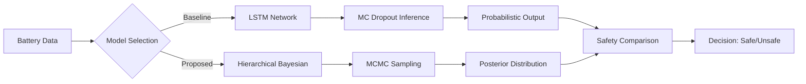

# Safety-Critical Battery Prognostics 🔋
**A Comparative Study: Hierarchical Bayesian Methods vs. Deep Learning (LSTM) for RUL Prediction**

[](https://www.python.org/downloads/)
[](https://pytorch.org/)
[](https://www.pymc.io/)
[](https://opensource.org/licenses/MIT)

> **Core Research Question**: In safety-critical industrial systems, is it better to be *precisely wrong* (Deterministic DL) or *vaguely right* (Bayesian Inference)?

## 📖 Project Overview
This research project addresses the "Black Box" problem in predictive maintenance. While Long Short-Term Memory (LSTM) networks offer high accuracy for Remaining Useful Life (RUL) prediction, they often fail to capture **epistemic uncertainty**—a critical flaw when making decisions for high-stakes assets like EV batteries or aerospace components.

Using the **NASA PCoE Battery Dataset**, this repository implements and compares:
1.  **Baseline**: A deterministic LSTM with **MC Dropout** for approximate Bayesian uncertainty.
2.  **Proposed**: A Hierarchical Probabilistic Degradation Model (Full Bayesian Inference).

## 🛡️ Impact & Safety Significance
This project aligns with **ISO 26262** functional safety requirements by providing probabilistic bounds rather than blind point estimates. Such systems are critical for **Level 4 autonomous systems**, where failure to quantify uncertainty could lead to catastrophic battery thermal runaway.

## 📊 Key Findings (The "Safety Gap")
The visualization below demonstrates the critical advantage of the Bayesian approach on Test Battery `B0018`:


* **Red Line (LSTM)**: Provides a single point estimate. It fails to account for the capacity regeneration phenomena (spikes) and offers no warning of confidence loss.
* **Green Zone (Bayesian)**: The 95% High Density Interval (HDI) successfully widens as data becomes scarce or noisy, providing a necessary **"Safety Buffer"** for human operators.

## 🏗️ System Architecture



## ⚠️ Limitations & Future Work
1.  **Dataset Scope**: This study utilizes the NASA PCoE dataset ($N=4$ test batteries). While sufficient for method validation, industrial deployment would require validation on larger datasets (e.g., CALCE, MIT-Stanford).
2.  **Computational Cost**: MCMC sampling is computationally intensive compared to LSTM inference. Future work will explore Variational Inference (VI) for real-time applicability.


## 🚀 Quick Start

### 1. Installation
```bash
git clone https://github.com/Zhi-Chao-PAN/safety-critical-battery-prognostics.git
cd safety-critical-battery-prognostics
pip install -r requirements.txt
```
